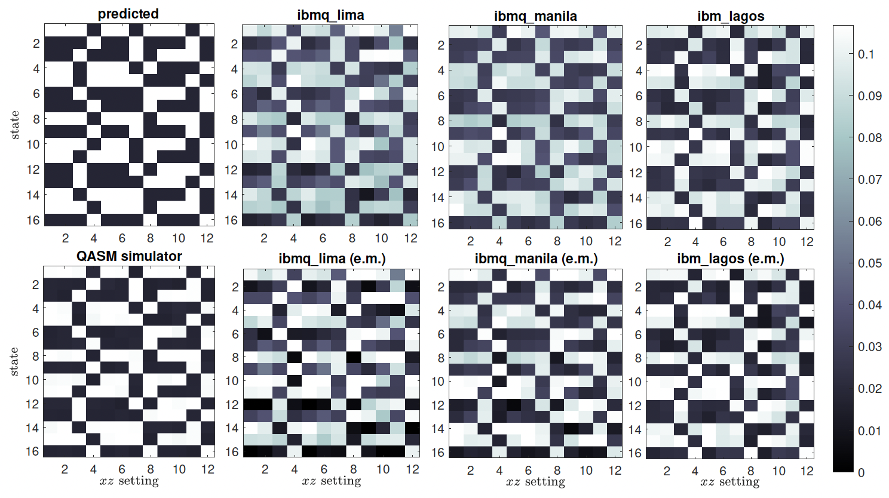

# Testing CHSH inequality on quantum computers

 
  Conditional probabilities $P(abc|xz)$ for CHSH experiment performed on several IBM quantum devices as well as the QASM simulator and a theoretical prediction.

