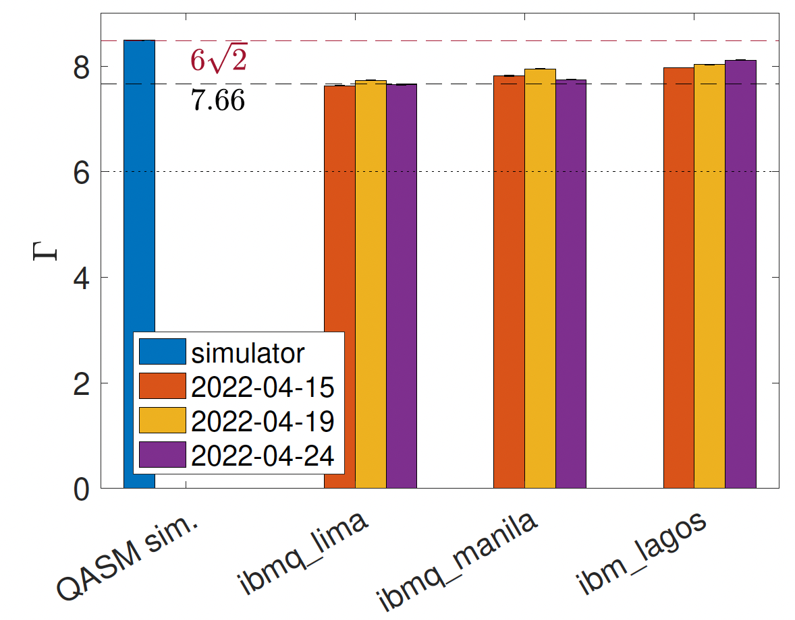

# Testing CHSH inequality on quantum computers
-----------------------------------------------
blahblahblahblah

blahblahblahblah

blahblahblahblah

blahblahblahblah

 
  Score $\Gamma$ for CHSH inequality experiment for several IBM devices.

The main [notebook](CHSHsimulation.ipynb) shows the basic copmutation scheme for using [IBM quantum](https://www.ibm.com/quantum) devices to perform a recently proposed experiment [1] designed to test the necessity of complex numbers in quantum mechanics. The original experiment has been performed using custom-fabricated qubits [2] as well as photonic systems [3]. The aim of the present work is to demonstrate the ease by which this experiment can be performed using freely-available resources from IBM Quantum. A formal writeup can be found [here](https://arxiv.org/abs/2205.01262).

The main notebook was used for obtaining the data used in Ref. [4]. Three quantum processors were used to collect data:

- ibmq_lima v1.0.35, a Falcon r4T processor
- ibmq_manila v1.0.29, a Falcon r5.11L processor
- ibm_lagos v1.0.27, a Falcon r5.11H processor

The scores shown above have been processed using basic readout-error mitigation. As shown in the figure above, even error-corrected results are unimpressive for ibmq_lima. Additionally, daily recalibration of the hardware causes the results to drift. This drift can make firm conclusions somewhat difficult to obtain when the final scores are so close to the real/complex threshold of 7.66. However, ibm_lagos (which is available to members of the [IBM Quantum Researchers program](https://quantum-computing.ibm.com/programs/researchers)) shows consistently strong results which are separated from the boundary by many standard deviations.

The enclosed [notebook](CHSHsimulation.ipynb) describes the specific quantum circuits needed to perform the experiment and mitigate readout errors. The uploaded version makes use of ibmq_manila, but the device can be changed to any device to which the user has access.

### Some final caveats:

- This approach lets someone with only minimal Qiskit/IBM quantum knowledge perform legitimate experiments which traditionally require a wealth of experience and resources; it should be noted, however, that wide accessibility does carry some limitations. For example, a typical user does not have high-level control over calibrations, and the locality loophole cannot be closed.

- The author acknowledges the use of IBM Quantum services for this work. The views expressed are those of the author and do not reflect the official policy or position of IBM or the IBM Quantum team. Additionally, the author acknowledges the access to advanced services provided by the IBM Quantum Researchers Program.

---------------------------------------------------

 
  Score $\Gamma$ for CHSH inequality experiment for several IBM devices.

### References

1. [M.-O. Renou, D. Trillo, M. Weilenmann, T. P. Le, A. Tavakoli, N. Gisin, A. Acín, and M. Navascués, <i>Nature</i> <b>600</b>, 625
(2021)](https://doi.org/10.1038/s41586-021-04160-4)

2. [M.-C. Chen, C. Wang, F.-M. Liu, J.-W. Wang, C. Ying, Z.-X. Shang, Y. Wu, M. Gong, H. Deng, F.-T. Liang, et al., <i>Phys. Rev. Lett.</i> <b>128</b>, 040403 (2022)](https://link.aps.org/doi/10.1103/PhysRevLett.128.040403)

3. [Z.-D. Li, Y.-L. Mao, M. Weilenmann, A. Tavakoli, H. Chen, L. Feng, S.-J. Yang, M.-O. Renou, D. Trillo, T. P. Le, et al., <i>Phys. Rev. Lett.</i> <b>128</b>, 040402 (2022)](https://link.aps.org/doi/10.1103/PhysRevLett.128.040402)

4. J. L. Lancaster, [arXiv:2205.01262](https://arxiv.org/abs/2205.01262)

5. [J. L. Miller, <i>Physics Today</i> <b>75</b>(3) 14, (2022)](https://physicstoday.scitation.org/doi/10.1063/PT.3.4955)
